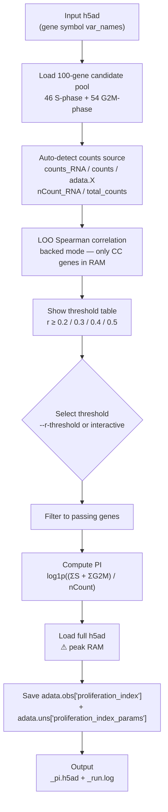

# Proliferation Index (PI) — adaptive scRNA-seq scoring

Compute a data-adaptive **Proliferation Index** for any scRNA-seq h5ad file.
Implements the SciPlex / monocle3 PI formula with optional gene selection via Leave-One-Out (LOO) Spearman correlation.

---

## Installation

```bash
pip install git+https://github.com/Dododongr/proliferation-index.git
```

All dependencies (`anndata`, `numpy`, `scipy`, `pandas`, `matplotlib`, `psutil`) are installed automatically.

---

## Usage

### Interactive (recommended for first run)
```bash
p_index --input data.h5ad
```
Runs LOO, shows gene counts per threshold, asks you to pick.

### Non-interactive (pipeline)
```bash
p_index --input data.h5ad --r-threshold 0.2
```

### Custom output path
```bash
p_index --input data.h5ad --output data_with_pi.h5ad --r-threshold 0.2
```

### All options
| Argument | Default | Description |
|---|---|---|
| `--input` | *(required)* | Input h5ad (gene symbol var_names) |
| `--output` | `<input>_pi.h5ad` | Output h5ad path |
| `--r-threshold` | interactive | LOO r threshold: 0.2 / 0.3 / 0.4 / 0.5 |
| `--preset` | `auto` | `auto` · `seurat` · `scanpy` |
| `--counts-layer` | auto-detected | Override raw counts layer name |
| `--libsize-key` | auto-detected | Override total UMI obs column name |
| `--gene-pool` | built-in | Path to custom gene pool JSON |

---

## Algorithm



### PI formula
```
PI = log1p( (Σ S-phase raw counts + Σ G2M-phase raw counts) / total UMI )
```
Matches the monocle3-based `proliferation_index` from [Srivatsan et al. 2020 (SciPlex)](https://www.science.org/doi/10.1126/science.aax6234).

---

## Validation

Tested on **SciPlex3** (581,777 cells × 58,347 genes, 3 cell lines).

### vs monocle3 `proliferation_index` (reference)

| Gene list   | N genes | Spearman r | A549  | K562  | MCF7  |
|-------------|---------|------------|-------|-------|-------|
| Pool (100)  | 100     | **0.906**  | 0.994 | 0.994 | 0.996 |
| LOO r ≥ 0.2 | 30      | 0.776      | 0.905 | 0.887 | 0.894 |
| LOO r ≥ 0.3 | 9       | 0.727      | 0.811 | 0.776 | 0.839 |

### vs MKI67 expression (canonical proliferation marker, MKI67 excluded from PI)

| Gene list   | N genes | r vs MKI67 |
|-------------|---------|------------|
| Pool (100)  | 99      | 0.492      |
| LOO r ≥ 0.2 | 29      | **0.508**  |
| LOO r ≥ 0.3 | 8       | 0.486      |

### Interpretation

LOO filtering reduces correlation with monocle3 PI as fewer genes are used. However, correlation with the canonical proliferation marker MKI67 remains stable across thresholds, indicating that LOO filtering does not remove core proliferative signal — it removes genes with weaker independent contributions.

**Recommended threshold: r ≥ 0.2** — best balance between gene coverage and signal purity. Researchers who prefer maximum concordance with monocle3 PI can use the full pool (no threshold); those who prefer data-adaptive, parsimonious gene selection can apply LOO filtering.

---

## Input requirements

| Field | Required | Notes |
|---|---|---|
| `var_names` | gene symbols | e.g. `MCM5`, not Ensembl IDs |
| `layers['counts_RNA']` | one of these | Seurat-converted h5ad |
| `layers['counts']` | one of these | Scanpy-native |
| `adata.X` | one of these | fallback |
| `obs['nCount_RNA']` | one of these | Seurat total UMI |
| `obs['total_counts']` | one of these | Scanpy total UMI |

Auto-detected by `--preset auto` (default). Override with `--preset seurat/scanpy` or explicit `--counts-layer` / `--libsize-key`.

---

## Output

**`_pi.h5ad`** — original h5ad with two additions:

```python
adata.obs["proliferation_index"]       # float, log1p scale, one value per cell

adata.uns["proliferation_index_params"] = {
    "r_threshold":  0.2,
    "counts_layer": "counts_RNA",
    "libsize_key":  "nCount_RNA",
    "n_genes_S":    5,
    "n_genes_G2M":  25,
    "genes_S":      [...],
    "genes_G2M":    [...],
}
```

**`_run.log`** — timestamped RAM and runtime log per phase.
**`_error.log`** — saved only on failure, includes full traceback.

---

## Gene lists

| File | N genes | Description |
|---|---|---|
| `cc_genes_pool.json` | 100 | Full candidate pool (default) |
| `cc_genes_r02.json` | 30 | LOO r ≥ 0.2 filtered (SciPlex3) |
| `cc_genes_r03.json` | 9 | LOO r ≥ 0.3 filtered (SciPlex3) |
| `regev_lab.json` | — | Tirosh et al. 2015 |
| `seurat_default.json` | — | Seurat built-in |

---

## Memory estimate

| Phase | RAM |
|---|---|
| LOO (backed mode) | n_cells × 100 genes × 4 B ≈ **270 MB** for 336k cells |
| Write-back (full load) | ≥ 2× h5ad file size |
